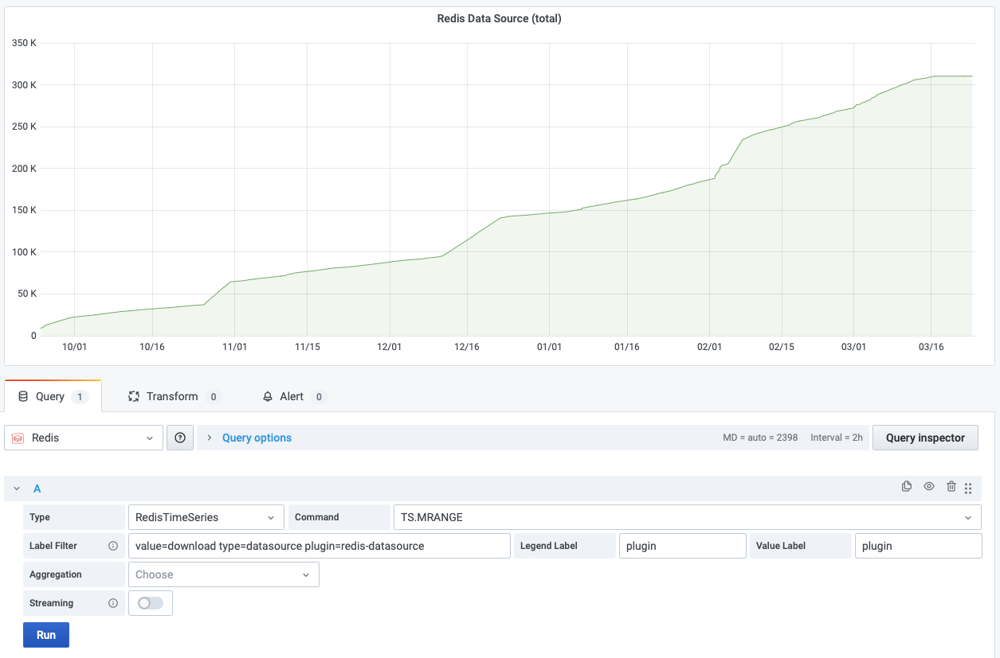

# TS.MRANGE

This command query a timestamp range across multiple time series by a filter.

!!! info "RedisTimeSeries"

    [https://redis.io/commands/ts.mrange/](https://redis.io/commands/ts.mrange/)

## Parameters

| Parameter                          | Description                                                                                                                   |
| ---------------------------------- | ----------------------------------------------------------------------------------------------------------------------------- |
| Label Filter                       | [Filters](https://redis.io/docs/data-types/timeseries/quickstart/#filtering). A minimum of one **l=v** filter must be applied |
| Legend Label                       | Label for Frame's name. Will be displayed for two or more time series                                                         |
| Value Label                        | Label for Series's name. Will be displayed in the legend                                                                      |
| Aggregation                        | Aggregation type                                                                                                              |
| Time Bucket (Aggregation enabled)  | Time bucket for Aggregation in milliseconds                                                                                   |
| Fill Missing (Aggregation enabled) | If checked, the data source will fill missing intervals                                                                       |
| Group By                           | The label to group the time series by                                                                                         |
| Reducer (Group By enabled)         | The reducer to use on the grouped time series                                                                                 |

!!! note "Labels"

    If **Legend Label** is not provided, series will have all labels returned.

      Labels can be [Transformed](https://grafana.com/docs/grafana/latest/panels/transformations/) if required.

--8<-- "includes/redis-datasource/time-series-aggregation.md"

## Streaming

Streaming is not supported.

## Visualization

Any standard visualization should work.
