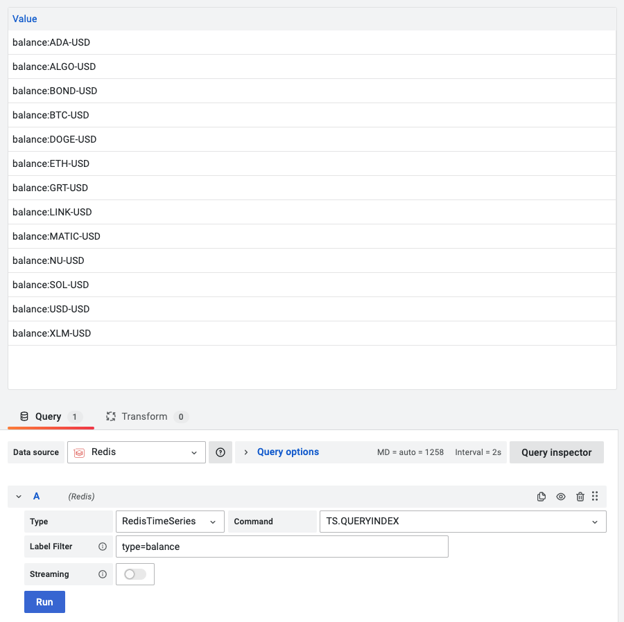

# TS.QUERYINDEX

This command query all the keys matching the filter list.

!!! info "RedisTimeSeries"

    [https://oss.redislabs.com/redistimeseries/commands/#tsqueryindex](https://oss.redislabs.com/redistimeseries/commands/#tsqueryindex)

## Parameters

| Parameter    | Description                                                                                                               |
| ------------ | ------------------------------------------------------------------------------------------------------------------------- |
| Label Filter | [Filters](https://oss.redislabs.com/redistimeseries/commands/#filtering). A minimum of one **l=v** filter must be applied |

## Streaming

Streaming supported as **Data frame**.

## Visualization

- Table
