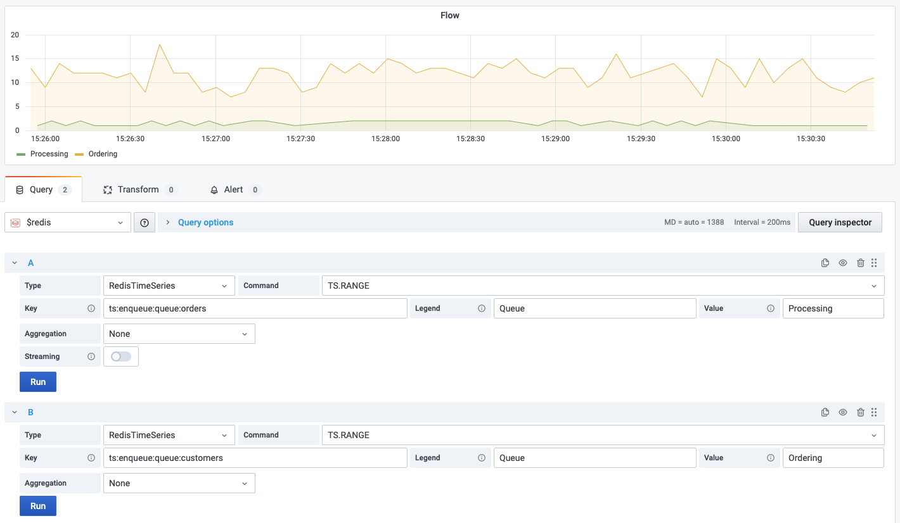

# TS.RANGE

This command query a range in a forward direction.

!!! info "RedisTimeSeries"

    [https://oss.redislabs.com/redistimeseries/commands/#tsrangetsrevrange](https://oss.redislabs.com/redistimeseries/commands/#tsrangetsrevrange)

## Parameters

| Parameter                          | Description                                             |
| ---------------------------------- | ------------------------------------------------------- |
| Key                                | Key name                                                |
| Legend                             | Frame's name. Displayed for two or more Queries         |
| Value                              | Serie's name. Displayed in the legend                   |
| Aggregation                        | Aggregation type                                        |
| Time Bucket (Aggregation enabled)  | Time bucket for Aggregation in milliseconds             |
| Fill Missing (Aggregation enabled) | If checked, the data source will fill missing intervals |

--8<-- "includes/redis-datasource/time-series-aggregation.md"

## Streaming

Streaming supported as **Time Series** and **Data frame**.

!!! important "Value"

    Provide the **Value** to merge streaming results.

## Visualization

Any standard visualization should work.
