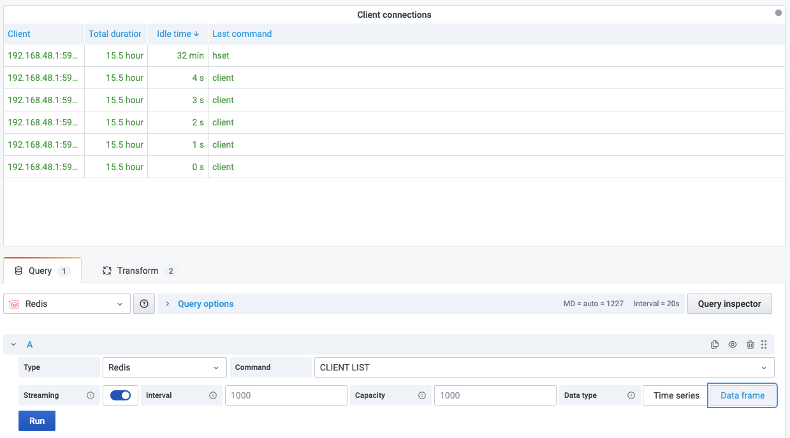

# CLIENT LIST

This command returns information and statistics about the client connections server.

!!! info "Redis Core"

    [https://redis.io/commands/CLIENT-LIST](https://redis.io/commands/CLIENT-LIST)

## Parameters

No parameters is required.

## Streaming

Streaming supported as **Data frame**.

## Visualization

- Table
