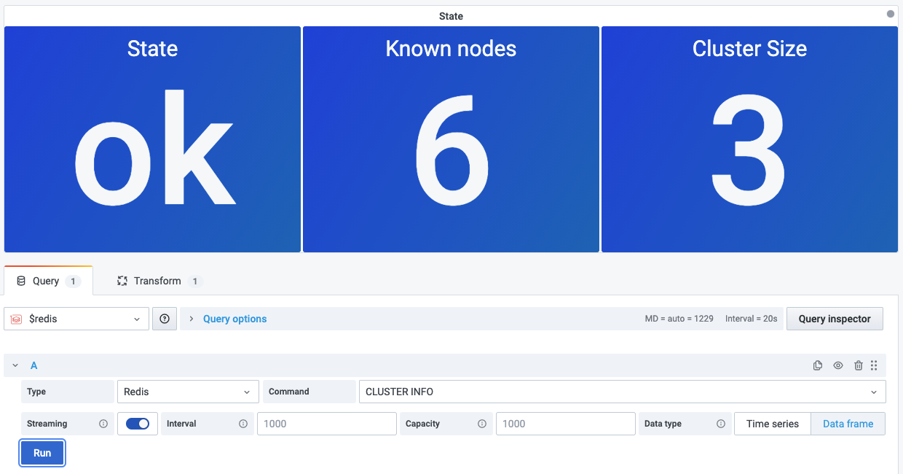

# CLUSTER INFO

This command provides INFO style information about Redis Cluster vital parameters.

!!! info "Redis Core"

    [https://redis.io/commands/CLUSTER-INFO](https://redis.io/commands/CLUSTER-INFO)

## Parameters

No parameters is required.

## Streaming

Streaming supported as **Data frame**.

--8<-- "includes/redis-datasource/visualization-any.md"
