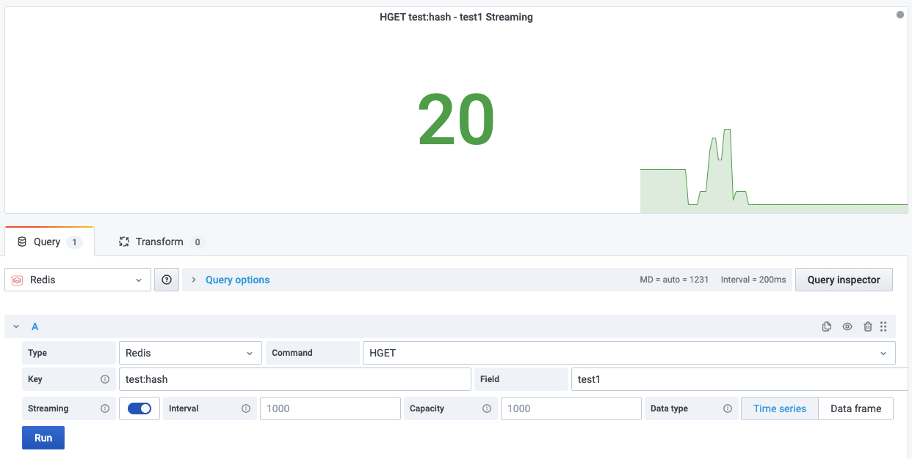

# HGET

This command returns the value associated with field in the hash stored at key.

!!! info "Redis Core"

    [https://redis.io/commands/HGET](https://redis.io/commands/HGET)

## Parameters

| Parameter | Description       |
| --------- | ----------------- |
| Key       | Key name          |
| Field     | Field in the hash |

--8<-- "includes/redis-datasource/streaming-any.md"

--8<-- "includes/redis-datasource/visualization-any.md"
