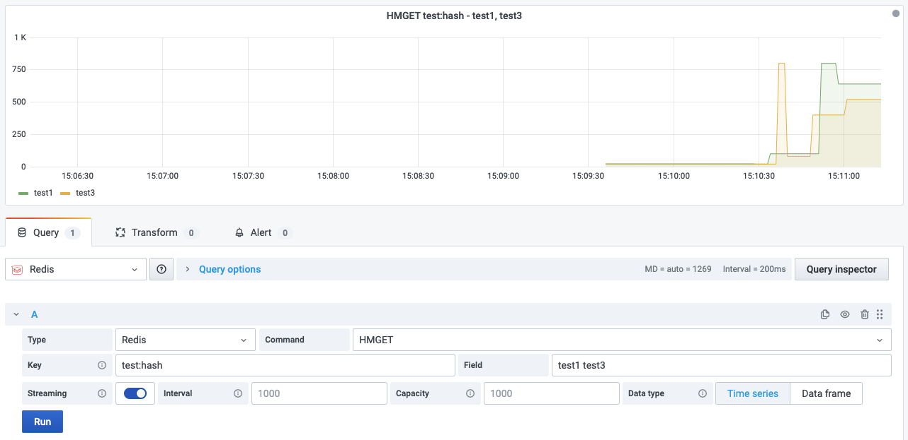

# HMGET

This command returns the values associated with the specified fields in the hash stored at key.

!!! info "Redis Core"

    [https://redis.io/commands/HMGET](https://redis.io/commands/HMGET)

## Parameters

| Parameter | Description                                         |
| --------- | --------------------------------------------------- |
| Key       | Key name                                            |
| Field     | One or more fields in the hash separated with space |

--8<-- "includes/redis-datasource/streaming-any.md"

--8<-- "includes/redis-datasource/visualization-any.md"
