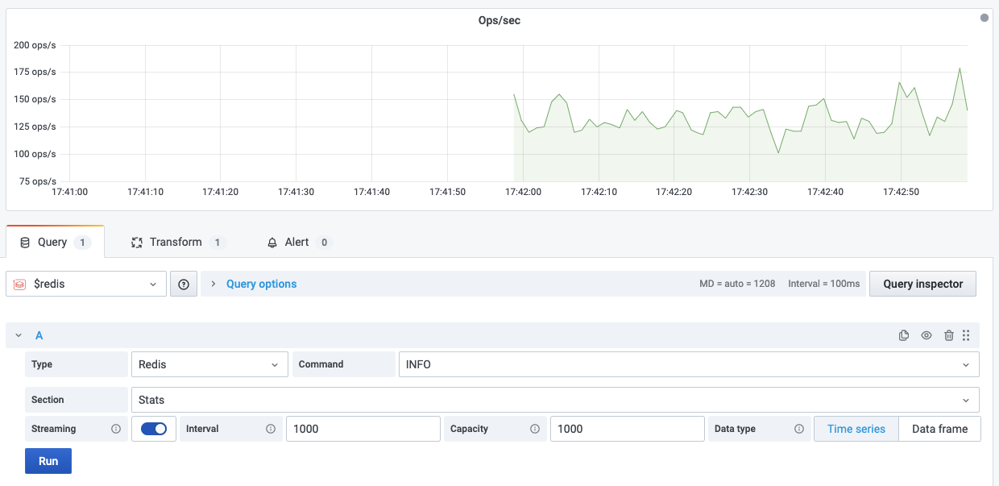
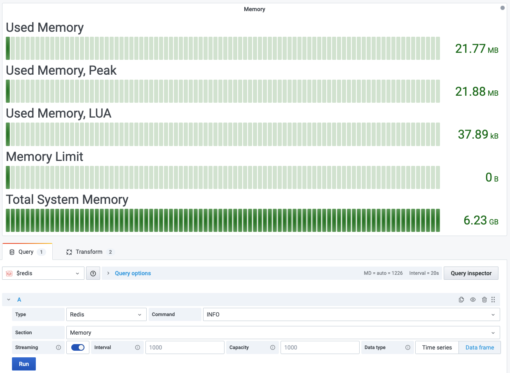

# INFO

Returns information and statistics about the server.

!!! info "Redis Core"

    [https://redis.io/commands/INFO](https://redis.io/commands/INFO)

## Parameters

| Parameter | Description            |
| --------- | ---------------------- |
| Section   | Section of information |

### Sections

| Section                  | Description                                | Streaming                   | Visualization |
| ------------------------ | ------------------------------------------ | --------------------------- | ------------- |
| Server                   | General information about the Redis server | Yes                         | Any           |
| Clients                  | Client connections                         | Yes                         | Any           |
| Memory                   | Memory consumption related information     | Yes                         | Any           |
| Persistence              | RDB and AOF related information            | Yes                         | Any           |
| Stats                    | General statistics                         | Yes                         | Any           |
| Replication              | Master/replica replication information     | Yes                         | Any           |
| CPU                      | CPU consumption statistics                 | Yes                         | Any           |
| Command Stats            | Redis command statistics                   | Number of calls per command | Any           |
| Cluster                  | Redis Cluster                              | Yes                         | Any           |
| Modules (not supported)  | Modules                                    | N/A                         | N/A           |
| Keyspace (not supported) | Database related statistics                | N/A                         | N/A           |
| Error Stats              | Redis error statistics (Redis 6.2)         | Yes                         | Any           |

!!! note "Command Latency"

    To see Latency per command, take a look at [Command Latency](../../redis-app/redis-latency-panel.md) panel.

## Streaming

Streaming is supported as **Time Series** and **Data frame** for the most sections. Check **Streaming** column for specific section.

## Visualization

Any standard visualization should work. Check **Visualization** column for specific section.

## Example

??? example "Clients"

    Dashboard contains formatted table with Streaming enabled.

    ---8<-- "includes/redis-datasource/commands/info-clients.md"

??? example "Memory"

    

    Dashboard contains bar gauge with Streaming enabled.

    ---8<-- "includes/redis-datasource/commands/info-memory.md"
