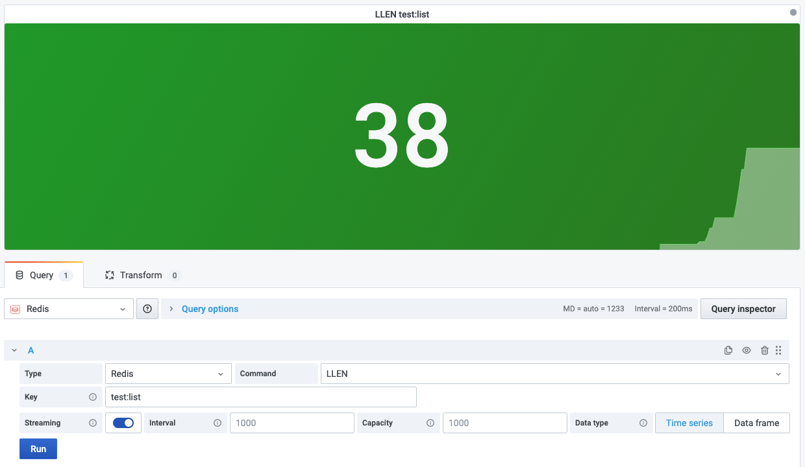

# LLEN

This command returns the length of the list stored at key.

!!! info "Redis Core"

    [https://redis.io/commands/LLEN](https://redis.io/commands/LLEN)

## Parameters

| Parameter | Description |
| --------- | ----------- |
| Key       | Key name    |

## Streaming

Streaming supported as **Time Series** and **Data frame**.

## Visualization

Any standard visualization should work.
