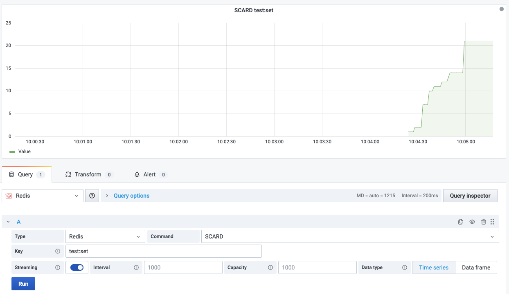

# SCARD

This command returns the set cardinality (number of elements) of the set stored at key.

!!! info "Redis Core"

    [https://redis.io/commands/SCARD](https://redis.io/commands/SCARD)

## Parameters

| Parameter | Description |
| --------- | ----------- |
| Key       | Key name    |

## Streaming

Streaming supported as **Time Series** and **Data frame**.

## Visualization

Any standard visualization should work.
