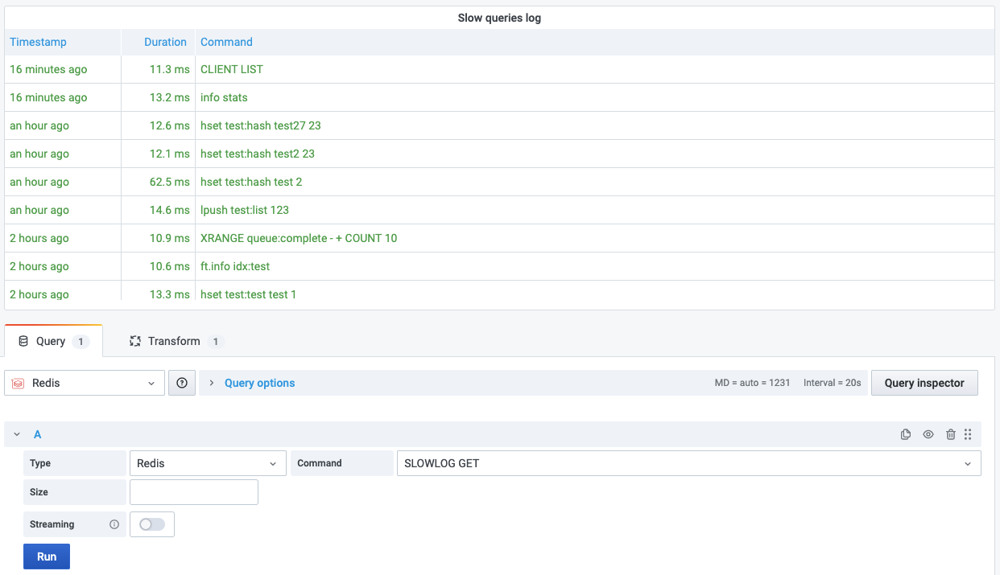

# SLOWLOG GET

This command returns the Redis slow queries log.

!!! info "Redis Core"

    [https://redis.io/commands/SLOWLOG](https://redis.io/commands/SLOWLOG)

## Parameters

| Parameter | Description                                   |
| --------- | --------------------------------------------- |
| Size      | Number of rows to return. Default value is 10 |

## Streaming

Streaming supported as **Data frame**.

## Visualization

- Table
