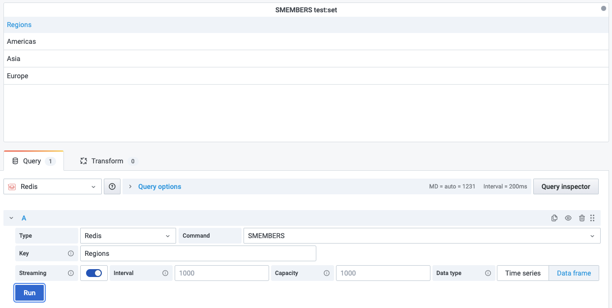

# SMEMBERS

This command returns all the members of the set stored at key.

!!! info "Redis Core"

    [https://redis.io/commands/SMEMBERS](https://redis.io/commands/SMEMBERS)

## Parameters

| Parameter | Description |
| --------- | ----------- |
| Key       | Key name    |

## Streaming

Streaming supported as **Data frame**.

## Visualization

- Table
