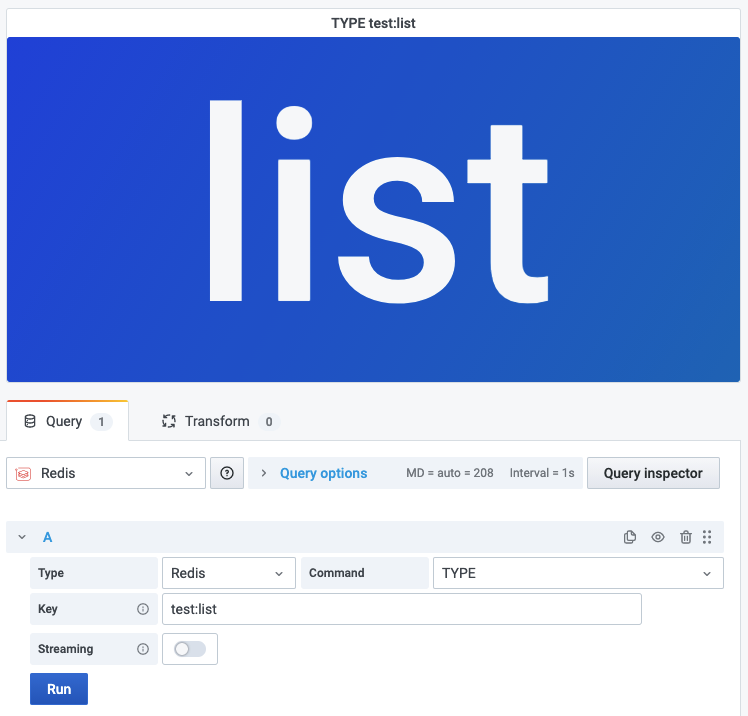

# TYPE

This command returns the string representation of the type of the value stored at key.

!!! info "Redis Core"

    [https://redis.io/commands/TYPE](https://redis.io/commands/TYPE)

## Parameters

| Parameter | Description |
| --------- | ----------- |
| Key       | Key name    |

## Streaming

N/A.

## Visualization

Any standard visualization should work.
