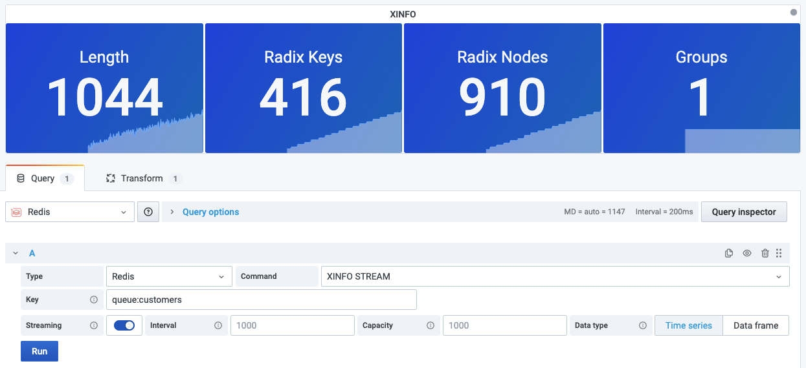

# XINFO

This is introspection command used in order to retrieve different information about the streams and associated consumer groups.

!!! info "Redis Core"

    [https://redis.io/commands/XINFO](https://redis.io/commands/XINFO)

## XINFO STREAM

Returns general information about the stream stored at the specified key.

### Parameters

| Parameter | Description |
| --------- | ----------- |
| Key       | Key name    |

--8<-- "includes/redis-datasource/streaming-any.md"

--8<-- "includes/redis-datasource/visualization-any.md"
