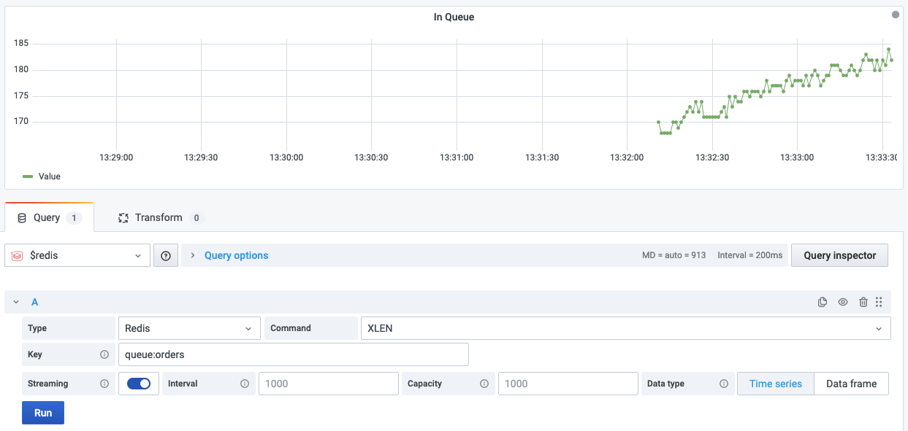

# XLEN

This command returns the number of entries inside a stream.

!!! info "Redis Core"

    [https://redis.io/commands/XLEN](https://redis.io/commands/XLEN)

## Parameters

| Parameter | Description |
| --------- | ----------- |
| Key       | Key name    |

--8<-- "includes/redis-datasource/streaming-any.md"

--8<-- "includes/redis-datasource/visualization-any.md"
