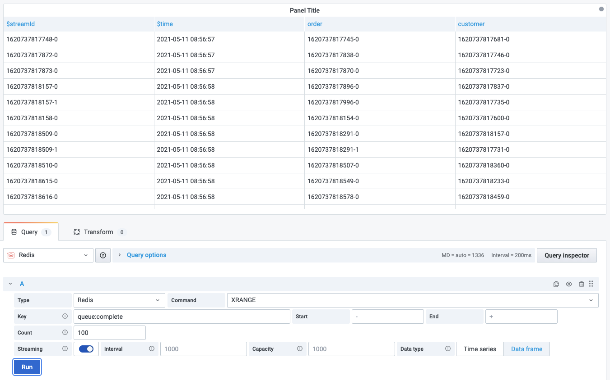

# XRANGE

This command returns the stream entries matching a given range of IDs.

!!! info "Redis Core"

    [https://redis.io/commands/XRANGE](https://redis.io/commands/XRANGE)

## Parameters

| Parameter | Description       | Default     |
| --------- | ----------------- | ----------- |
| Key       | Key name          |             |
| Start     | Range start       | - (minimum) |
| End       | Range end         | + (maximum) |
| Count     | Number of entries |             |

## Streaming

Streaming supported as **Data frame**.

!!! important "Time series"

    Streaming as Time series will return only the last line.

--8<-- "includes/redis-datasource/visualization-any.md"
