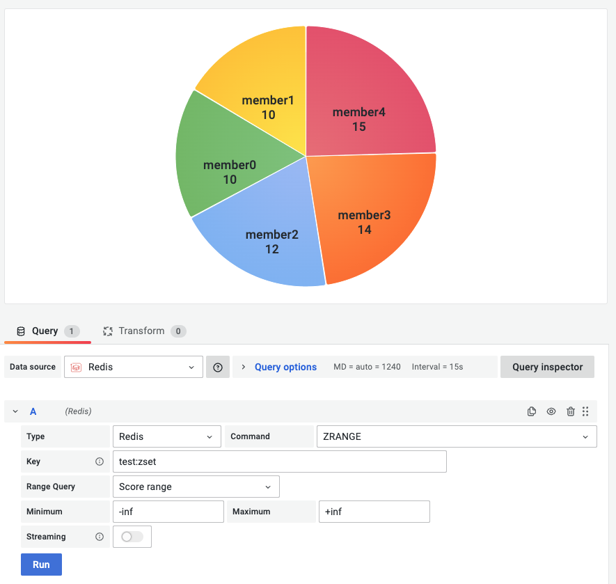

# ZRANGE

This command returns the specified range of elements in the sorted set stored at key.

!!! info "Redis Core"

    [https://redis.io/commands/ZRANGE](https://redis.io/commands/ZRANGE)

## Parameters

| Parameter   | Description                     | Default     |
| ----------- | ------------------------------- | ----------- |
| Key         | Key name                        |             |
| Range Query | By index (rank) or by the score | Score range |
| Minimum     | Range start                     |             |
| Maximum     | Range end                       |             |

--8<-- "includes/redis-datasource/streaming-any.md"

--8<-- "includes/redis-datasource/visualization-any.md"
