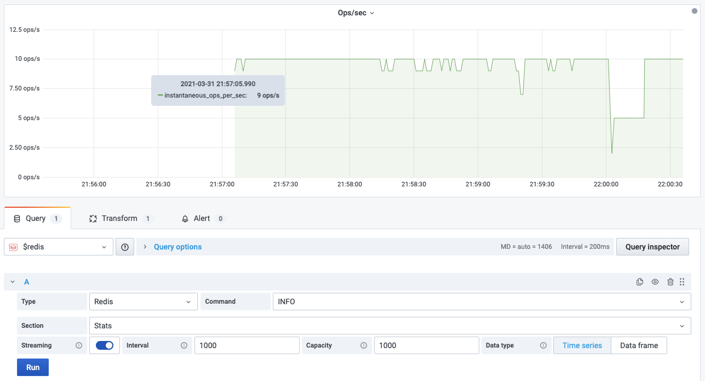

# Streaming support

Redis Data Source supports streaming data for the most commands. Please take a look at specific command for details.

!!! note "A dot in the top right corner"

    Since Grafana 7.4 a dot in the top right corner means that Streaming is enabled.

## Parameters

### Interval

Streaming interval in milliseconds. Default is 1000ms.

### Capacity

Values will be constantly added and will never exceed the given capacity. Default is 1000ms.

## Data type

Streaming data supported as Time series and Data frames.

### Time series

When selected, `time` field will be added or replaced to allow display values on Chart.

If command return more than one line, the last line of data will be returned.

### Data frame

When selected, data will be refreshed as is.

!!! example "[RG.DUMPREGISTRATIONS](redis-gears/RG-DUMPREGISTRATIONS.md)"

    
