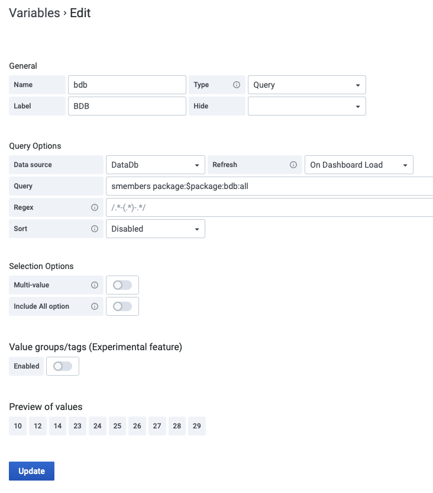
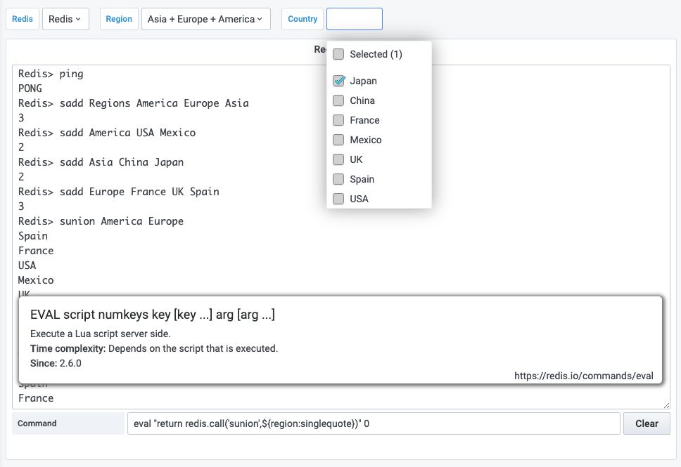

# Variables

Template variables can query [Commands](commands.md) and use other variables as parameters.

!!! note "Advanced variable format options"

    The formatting of the variable interpolation depends on the data source. There are some situations where you might want to change the [default formatting](https://grafana.com/docs/grafana/latest/variables/advanced-variable-format-options/).



## Supported Parameters

Variables will be replaced in the following parameters:

| Parameter | Description  | Command                                                                                        |
| --------- | ------------ | ---------------------------------------------------------------------------------------------- |
| Key       | Key name     | [GET](redis/GET.md), [XRANGE](redis/XRANGE.md), etc.                                           |
| Query     | CLI query    | Any                                                                                            |
| Field     | Hash Field   | [HGET](redis/HGET.md), [HMGET](redis/HMGET.md)                                                 |
| Filter    | Filter       | [TS.MRANGE](redis-timeseries/TS-MRANGE.md), [TS.QUERYINDEX](redis-timeseries/TS-QUERYINDEX.md) |
| Legend    | Frame's name | [TS.RANGE](redis-timeseries/TS-RANGE.md)                                                       |
| Value     | Serie's name | [TS.RANGE](redis-timeseries/TS-RANGE.md)                                                       |

## How to use SUNION for multi-select variable?



### LUA

The LUA script should work fine on a single shard deployment:

```bash
eval "return redis.call('sunion',${region:singlequote})" 0
```

### Redis Gears

Another option is to utilize [RedisGears](https://redisgears.io) module:

--8<-- "includes/redis-datasource/gears-sunion.md"

To execute the trigger in Grafana:

```bash
RG.TRIGGER SUNION ${region:csv}
```
