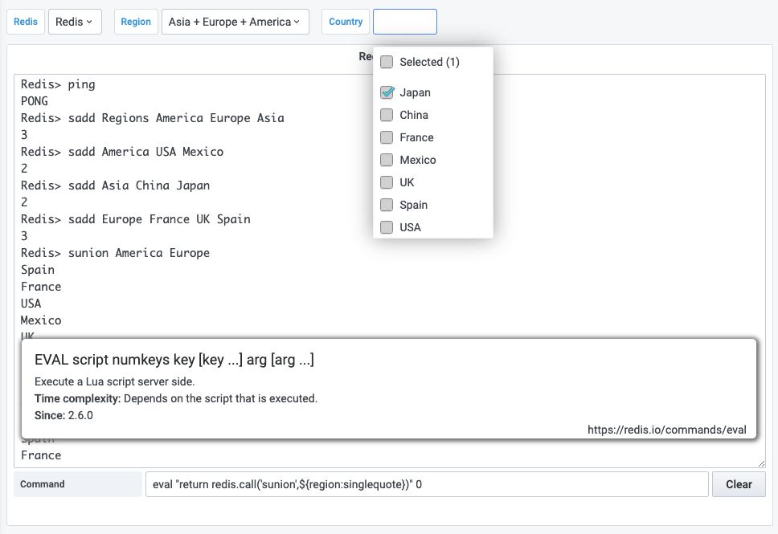

# Variables

Template variables can query command and use other variables as parameters:


## How to use SUNION for multi-select variable?

The LUA script should work fine on a single shard deployment:

```
eval "return redis.call('sunion',${region:singlequote})" 0
```



Another option is to utilize [RedisGears](https://redisgears.io) module:

```
{{ include('redis-datasource/gears-sunion.py') }}
```

To execute the trigger in Grafana:

```
RG.TRIGGER SUNION ${region:csv}
```
