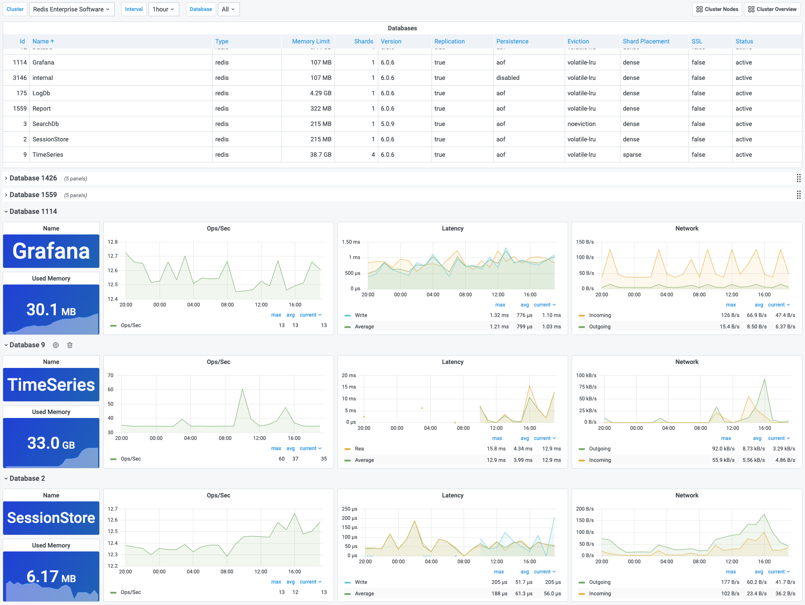

# Cluster Databases

Cluster Databases dashboard provides information and metrics for each databases managed by cluster.

## Panels

- Databases table
- Name, Used Memory, Ops/Sec, Latency and Network for each database
