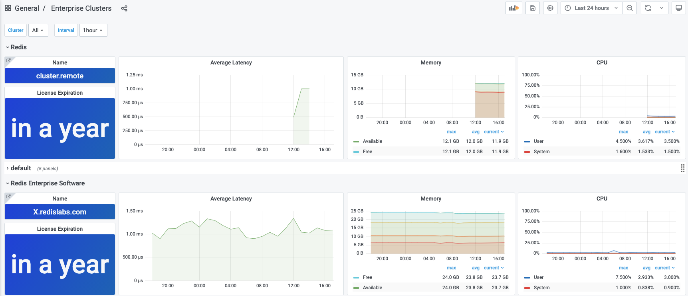

# Enterprise Clusters

Enterprise Clusters dashboard provides basic information about the cluster, license, and displays most important metrics.

## Panels

- Cluster's name
- License Expiration
- Average Latency
- Memory
- CPU
