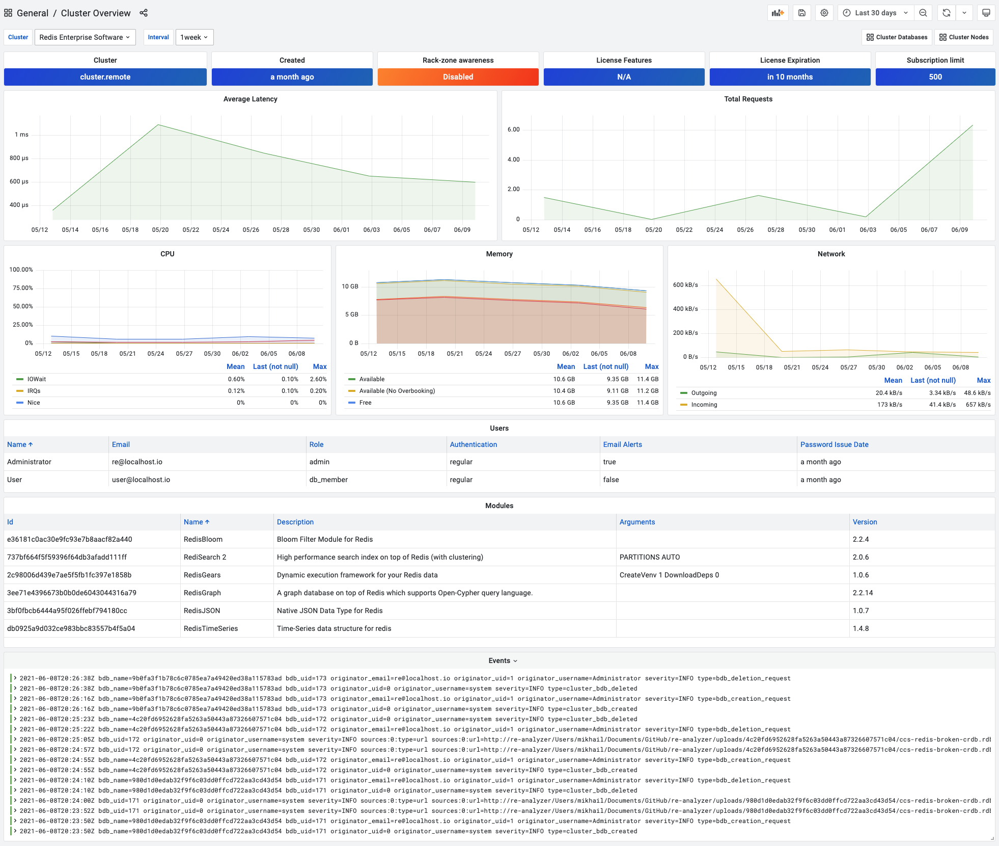

# Cluster Overview

Cluster Overview dashboard provides the most important information and metrics for the selected cluster.

## Panels

- Cluster's name, when cluster was created and rack-zone awareness
- License Featurer, Expiration and Subscription Limit
- Average Latency
- Total Requests
- CPU
- Memory
- Network
- Users
- Modules
- Events
- Alerts for Databases and Nodes
