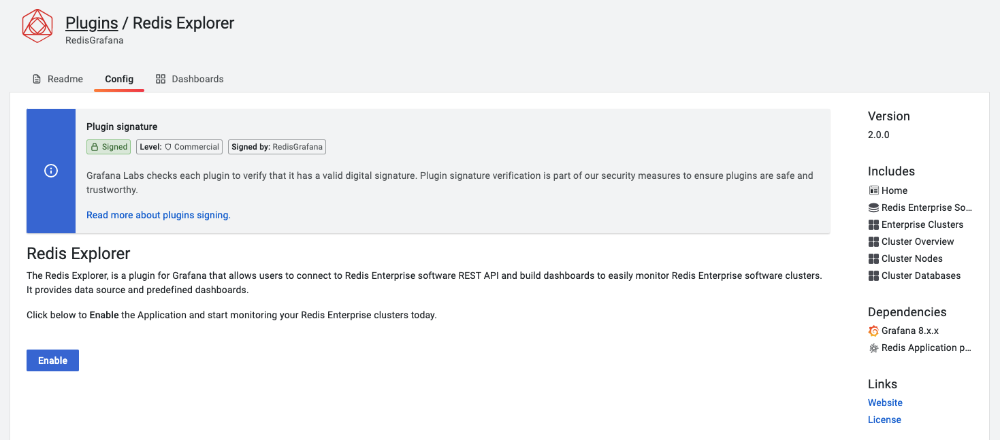

# Redis Explorer plug-in

  

The Redis Explorer is a plug-in for Grafana that allows connecting to Redis Enterprise software clusters using REST API. It provides application pages to add Redis Data Sources for managed databases and dashboards to see cluster configuration.

## Features comparison

|                                                       | Redis endpoint (open-source)                                                                                       | Redis Enterprise                                                                                                                   |
| ----------------------------------------------------- | ------------------------------------------------------------------------------------------------------------------ | ---------------------------------------------------------------------------------------------------------------------------------- |
| [Redis Data Source](../redis-datasource/overview.md)  | [Stats](../redis-datasource/redis/INFO.md), [Streaming](../redis-datasource/streaming.md), Data                    |                                                                                                                                    |
| [Redis Application plug-in](../redis-app/overview.md) | [Dashboards](../redis-app/overview.md#dashboards), [Custom Panels](../redis-app/overview.md#custom-panels)         |                                                                                                                                    |
| Redis Explorer plug-in                                | Use Redis Data Source                                                                                              | [Metrics](re-software/metrics.md), [Information](re-software/info.md)                                                              |
| Prometheus                                            | [Redis Exporter for metrics](https://grafana.com/oss/prometheus/exporters/redis-exporter/?pg=prod-cloud-resources) | [Redis Enterprise metrics exporter](https://docs.redislabs.com/latest/rs/administering/monitoring-metrics/prometheus-integration/) |

## Enable Plug-in

The Redis Explorer plug-in is disabled after installation by default. To enable:

- Go to `Configuration` -> `Plugins` and choose Redis Explorer plug-in.

- Click **Enable** to add side menu, add Redis Enterprise software data source and import Dashboards.

## Home

The **Home** page connects to every configured data source and retrieve cluster's name.

!!! important "Loading Time"

    Page load can take a long time if clusters located far away from Grafana or data source can't connect (timeout).

### Add Redis Enterprise Software Data Source

To add new data source click on **Add Redis Enterprise Software** button and configure data source providing connection details.

### Add Redis databases

To add databases managed by Redis Enterprise cluster as Data Sources click on the **Databases** button.

## Dashboards

Redis Explorer plug-in includes predefined dashboards:

- [Enterprise Clusters](dashboards/explorer.md)
- [Cluster Overview](dashboards/overview.md)
- [Cluster Nodes](dashboards/nodes.md)
- [Cluster Databases](dashboards/databases.md)

!!! important "Application Icon"

    All dashboards are accessible from the Application's icon in the left side menu.

## Provisioning

Grafana supports managing plugins in Grafana by [adding one or more YAML config files](https://grafana.com/docs/grafana/latest/administration/provisioning/) in the **provisioning/plugins** directory:

- Each config file can contain a list of apps that will be updated during start up.
- Grafana updates each app to match the configuration file.

---8<-- "includes/redis-explorer/provisioning-yaml.md"
