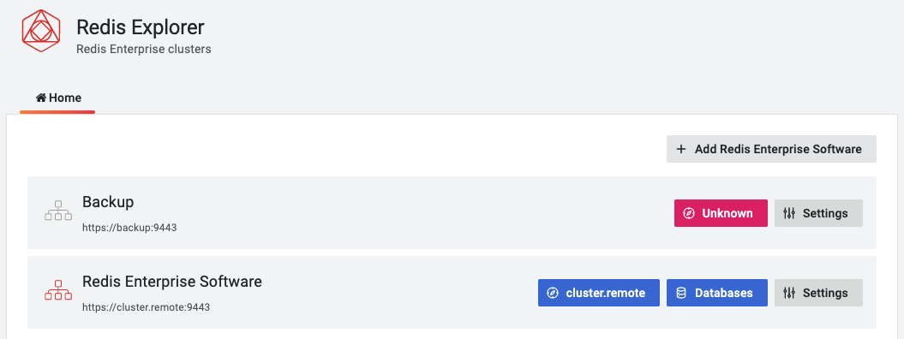
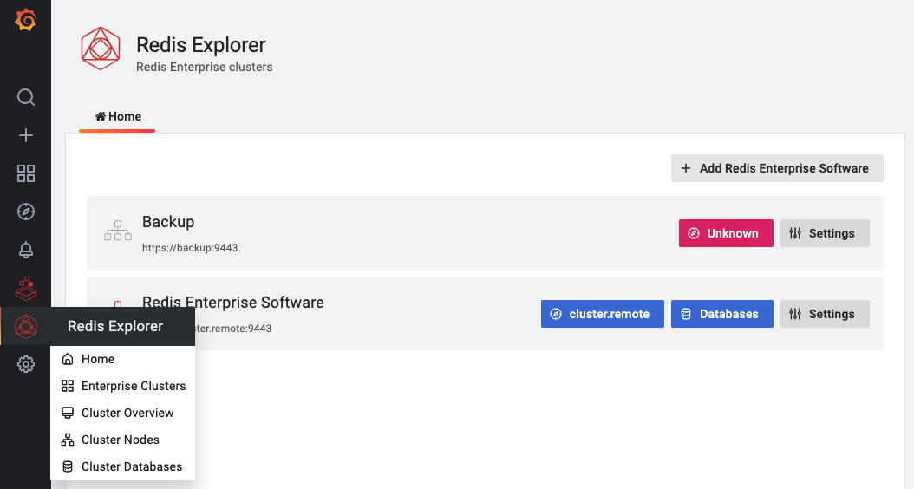

# Redis Explorer plugin

The Redis Explorer is a plugin for Grafana that allows connecting to Redis Enterprise software clusters using REST API. It provides application pages to add Redis Data Sources for managed databases and dashboards to see cluster configuration.

## Features

| Plugins \ Database                                   | Redis endpoint (open-source)                                                                                       | Redis Enterprise                                                                                                                   |
| ---------------------------------------------------- | ------------------------------------------------------------------------------------------------------------------ | ---------------------------------------------------------------------------------------------------------------------------------- |
| [Redis Data Source](../redis-datasource/overview.md) | [Stats](../redis-datasource/redis/INFO.md), [Streaming](../redis-datasource/streaming.md), Data                    |                                                                                                                                    |
| [Redis Application plugin](../redis-app/overview.md) | [Dashboards](../redis-app/overview.md#dashboards), [Custom Panels](../redis-app/overview.md#custom-panels)         |                                                                                                                                    |
| Redis Explorer plugin                                | Use Redis Data Source                                                                                              | [Metrics](re-software/metrics.md), [Information](re-software/info.md)                                                              |
| Prometheus                                           | [Redis Exporter for metrics](https://grafana.com/oss/prometheus/exporters/redis-exporter/?pg=prod-cloud-resources) | [Redis Enterprise metrics exporter](https://docs.redislabs.com/latest/rs/administering/monitoring-metrics/prometheus-integration/) |

## Quickstart

To learn how to install Redis Explorer plugin using `grafana-cli`, run using Docker or manually without Internet access follow the [Quickstart](../quickstart.md) page.

## Enable Plugin

The Redis Explorer plugin is disabled after installation by default. To enable:

- Go to `Configuration` -> `Plugins` and choose Redis Explorer plugin.

- Click **Enable** to add side menu, add Redis Enterprise software data source and import Dashboards.

## Home

The **Home** page connects to every configured data source and retrieve cluster's name.

!!! important "Loading Time"

    Page load can take a long time if clusters located far away from Grafana or data source can't connect (timeout).

### Add Redis Enterprise Software Data Source

To add new data source click on **Add Redis Enterprise Software** button and configure data source providing connection details.

### Add Redis databases

To add databases managed by Redis Enterprise cluster as Data Sources click on the **Databases** button.

## Dashboards

Redis Explorer plugin includes predefined dashboards:

- [Enterprise Clusters](dashboards/explorer.md)
- [Cluster Overview](dashboards/overview.md)
- [Cluster Nodes](dashboards/nodes.md)
- [Cluster Databases](dashboards/databases.md)

!!! important "Application Icon"

    All dashboards are accessible from the Application's icon in the left side menu.

## Provisioning

Grafana supports managing plugins in Grafana by [adding one or more YAML config files](https://grafana.com/docs/grafana/latest/administration/provisioning/) in the **provisioning/plugins** directory:

- Each config file can contain a list of apps that will be updated during start up.
- Grafana updates each app to match the configuration file.

---8<-- "includes/redis-explorer/provisioning-yaml.md"
