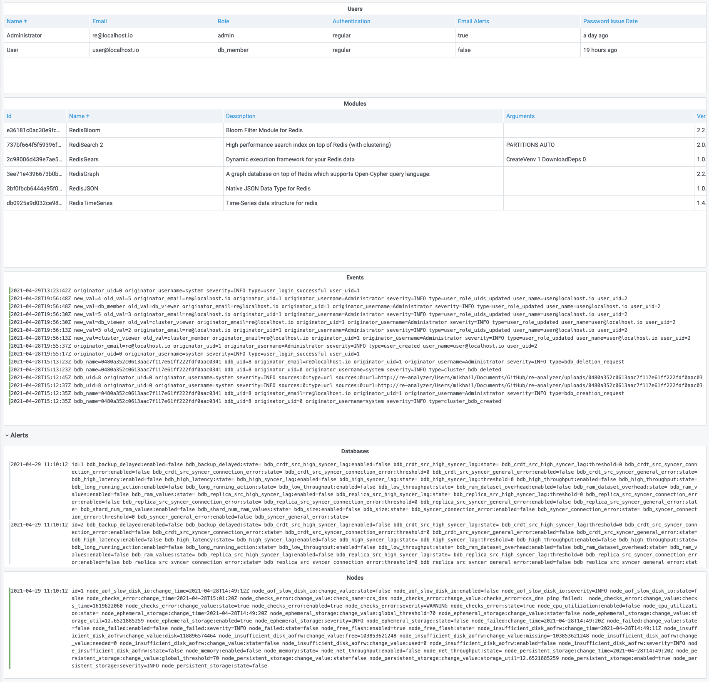

# Redis Enterprise Software Information

Redis Enterprise Software Data Source provides various information available in the REST API.

| Type         | Description                                    |
| ------------ | ---------------------------------------------- |
| Alerts       | Database and Nodes alerts                      |
| Cluster      | Cluster information                            |
| Cluster Logs | Cluster events log                             |
| Databases    | All databases or specific database information |
| License      | License information                            |
| Modules      | All modules or specific module information     |
| Nodes        | All nodes or specific node information         |
| Users        | All users or specific user information         |
