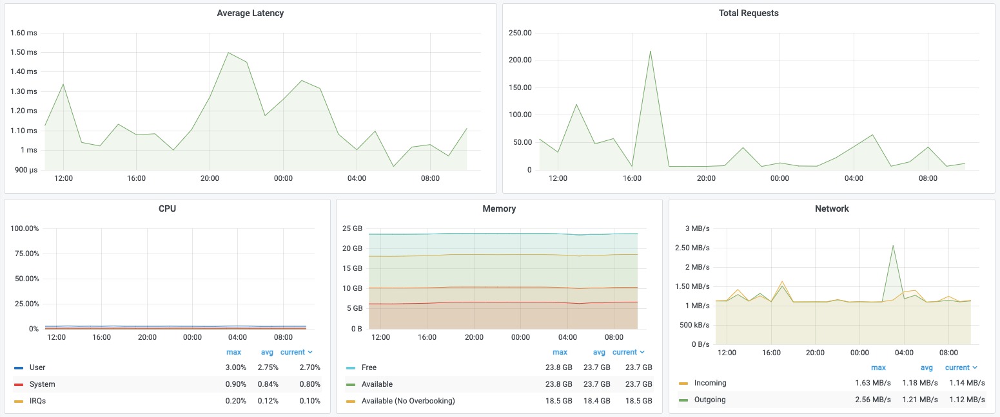
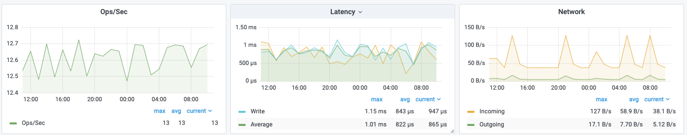
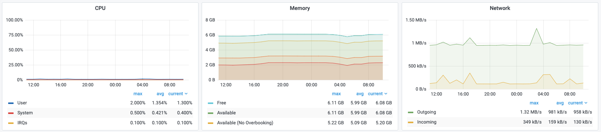

# Redis Enterprise Software Metrics

Redis Enterprise Software Data Source provides metrics available in the REST API.

## Cluster

| Metric name                       | Unit      | Feature | Description                                                                                                                              |
| --------------------------------- | --------- | ------- | ---------------------------------------------------------------------------------------------------------------------------------------- |
| available_flash                   | bytes     | Flash   | Sum of available flash in all nodes                                                                                                      |
| available_flash_no_overbooking    | bytes     | Flash   | Sum of available flash in all nodes without taking into account overbooking                                                              |
| available_memory                  | bytes     |         | Sum of available memory in all nodes                                                                                                     |
| available_memory_no_overbooking   | bytes     |         | Sum of available memory in all nodes without taking into account overbooking                                                             |
| avg_latency                       | micro-sec |         | Average latency of requests handled by all cluster endpoints                                                                             |
| bigstore_free                     | bytes     | Flash   | Sum of free space of back-end flash on all cluster nodes                                                                                 |
| bigstore_iops                     | ops/sec   | Flash   | Rate of i/o operations against back-end flash for all shards which are part of a flash based DB in cluster                               |
| bigstore_kv_ops                   | ops/sec   | Flash   | Rate of value read/write operations against back-end flash for all shards which are part of a flash based DB in cluster                  |
| bigstore_throughput               | bytes/sec | Flash   | Throughput i/o operations against back-end flash for all shards which are part of a flash based DB in cluster                            |
| conns                             |           |         | Total number of clients connected to all cluster endpoints                                                                               |
| cpu_idle                          | 0-1       |         | CPU idle time portion, the value is weighted between all nodes based on number of cores in each node                                     |
| cpu_iowait                        | 0-1       |         | CPU IOwait time portion                                                                                                                  |
| cpu_irqs                          | 0-1       |         | CPU IRQs time portion                                                                                                                    |
| cpu_nice                          | 0-1       |         | CPU Nice time portion                                                                                                                    |
| cpu_steal                         | 0-1       |         | CPU Steal time portion                                                                                                                   |
| cpu_system                        | 0-1       |         | CPU time portion spent in kernel on cluster, the value is weighted between all nodes based on number of cores in each node               |
| cpu_user                          | 0-1       |         | CPU time portion spent by users-pace processes on cluster, the value is weighted between all nodes based on number of cores in each node |
| egress_bytes                      | bytes/sec |         | Sum of rate of outgoing network traffic on all cluster nodes                                                                             |
| ephemeral_storage_avail           | bytes     |         | Sum of disk space available to RLEC processes on configured ephemeral disk on all cluster nodes                                          |
| ephemeral_storage_free            | bytes     |         | Sum of free disk space on configured ephemeral disk on all cluster nodes                                                                 |
| free_memory                       | bytes     |         | Sum of free memory in all cluster nodes                                                                                                  |
| ingress_bytes                     | bytes/sec |         | Sum of rate of incoming network traffic on all cluster nodes                                                                             |
| persistent_storage_avail          | bytes     |         | Sum of disk space available to cluster processes on configured persistent disk on all cluster nodes                                      |
| persistent_storage_free           | bytes     |         | Sum of free disk space on configured persistent disk on all cluster nodes                                                                |
| provisional_flash                 | bytes     | Flash   | Sum of provisional flash in all nodes                                                                                                    |
| provisional_flash_no_overbooking  | bytes     | Flash   | Sum of provisional flash in all nodes without taking into account overbooking                                                            |
| provisional_memory                | bytes     |         | Sum of provisional memory in all nodes                                                                                                   |
| provisional_memory_no_overbooking | bytes     |         | Sum of provisional memory in all nodes without taking into account overbooking                                                           |
| total_req                         | ops/sec   |         | Request rate handled by all endpoints on cluster                                                                                         |

## Database

| Metric name                | Unit             | Feature | Description                                                                                          |
| -------------------------- | ---------------- | ------- | ---------------------------------------------------------------------------------------------------- |
| avg_latency                | micro-sec        |         | Average latency of operations on the DB                                                              |
| avg_other_latency          | micro-sec        |         | Average latency of other (non read/write) operations                                                 |
| avg_read_latency           | micro-sec        |         | Average latency of read operations                                                                   |
| avg_write_latency          | micro-sec        |         | Average latency of write operations                                                                  |
| big_del_flash              | key access / sec | Flash   | Rate of key deletes for keys that happen to be on flash                                              |
| big_del_ram                | key access / sec | Flash   | Rate of key deletes for keys that happen to be in ram, this includes write misses (new keys created) |
| big_fetch_flash            | key access / sec | Flash   | Rate of key reads / updates for keys that happento be on flash                                       |
| big_fetch_ram              | key access / sec | Flash   | Rate of key reads / updates for keys that happento be in RAM                                         |
| big_io_ratio_flash         | key access / sec | Flash   | Rate of key operations on flash. can be used to compute ratio of io operations                       |
| big_io_ratio_redis         | key access / sec | Flash   | Rate of redis operations on keys. can be used to compute ratio of io operations                      |
| big_write_flash            | key access / sec | Flash   | Rate of key writes for keys that happen to be on flash                                               |
| big_write_ram              | key access / sec | Flash   | Rate of key writes for keys that happen to be in RAM, this includes write misses (new keys created)  |
| bigstore_io_dels           | key access / sec | Flash   | Rate of key deletions from flash                                                                     |
| bigstore_io_read_bytes     | bytes/sec        | Flash   | Throughput of i/o read operations against back-end flash for all shards of DB                        |
| bigstore_io_reads          | key access / sec | Flash   | Rate of key reads from flash                                                                         |
| bigstore_io_write_bytes    | bytes/sec        | Flash   | Throughput of i/o write operations against back-end flash for all shards of DB                       |
| bigstore_io_writes         | key access / sec | Flash   | Rate of key writes from flash                                                                        |
| bigstore_iops              | ops/sec          | Flash   | Rate of i/o operations against back-end flash for all shards of DB                                   |
| bigstore_kv_ops            | key access / sec | Flash   | Rate of value read/write/del operations against back-end flash for all shards of DB                  |
| bigstore_objs_flash        |                  | Flash   | Value count on flash                                                                                 |
| bigstore_objs_ram          |                  | Flash   | Value count in RAM                                                                                   |
| bigstore_throughput        | bytes/sec        | Flash   | Throughput of i/o operations against back-end flash for all shards of DB                             |
| conns                      |                  |         | Number of client connections to DB’s endpoints                                                       |
| disk_frag_ratio            |                  | Flash   | Flash fragmentation ratio (used / required)                                                          |
| egress_bytes               | bytes/sec        |         | Rate of outgoing network traffic to DB’s endpoint                                                    |
| evicted_objects            | evictions/sec    |         | Rate of key evictions from DB                                                                        |
| expired_objects            | evictions/sec    |         | Rate keys expired in DB                                                                              |
| fork_cpu_system            |                  |         | % cores utilization in system mode for all redis shard fork child processes of this database         |
| fork_cpu_user              |                  |         | % cores utilization in user mode for all redis shard fork child processes of this database           |
| ingress_bytes              | bytes/sec        |         | Rate of incoming network traffic to DB’s endpoint                                                    |
| instantaneous_ops_per_sec  | ops/sec          |         | Request rate handled by all shards of DB                                                             |
| last_req_time              |                  |         | Last request time received to DB, when not available returns 1/1/1970                                |
| last_res_time              |                  |         | Last response time received from DB, when not available returns 1/1/1970                             |
| main_thread_cpu_system     |                  |         | % cores utilization in system mode for all redis shard main threads of this database                 |
| main_thread_cpu_user       |                  |         | % cores utilization in user mode for all redis shard main threads of this database                   |
| mem_frag_ratio             |                  |         | RAM fragmentation ratio (RSS / allocated RAM)                                                        |
| mem_not_counted_for_evict  | bytes            |         | Portion of used_memory that’s not counted for eviction and OOM error                                 |
| mem_size_lua               | bytes            |         | Redis lua scripting heap size                                                                        |
| monitor_sessions_count     |                  |         | Number of client connected in monitor mode to the DB                                                 |
| no_of_expires              |                  |         | Number of volatile keys in the DB                                                                    |
| no_of_keys                 |                  |         | Number of keys in DB                                                                                 |
| other_req                  | ops/sec          |         | Rate of other (non read/write) requests on DB                                                        |
| other_res                  | ops/sec          |         | Rate of other (non read/write) responses on DB                                                       |
| pubsub_channels            |                  |         | Count the pub/sub channels with subscribed clients                                                   |
| pubsub_patterns            |                  |         | Count the pub/sub patterns with subscribed clients                                                   |
| ram_overhead               | bytes            | Flash   | Non values RAM overhead                                                                              |
| read_hits                  | ops/sec          |         | Rate of read operations accessing an existing key                                                    |
| read_misses                | ops/sec          |         | Rate of read operations accessing a non-existing key                                                 |
| read_req                   | ops/sec          |         | Rate of read requests on DB                                                                          |
| read_res                   | ops/sec          |         | Rate of read responses on DB                                                                         |
| shard_cpu_system           |                  |         | % cores utilization in system mode for all redis shard processes of this database                    |
| shard_cpu_user             |                  |         | % cores utilization in user mode for the redis shard process                                         |
| total_connections_received | connections/sec  |         | Rate of new client connections to DB                                                                 |
| total_req                  | ops/sec          |         | Rate of all requests on DB                                                                           |
| total_res                  | ops/sec          |         | Rate of all responses on DB                                                                          |
| used_bigstore              | bytes            | Flash   | Flash used by db                                                                                     |
| used_memory                | bytes            |         | Memory used by db                                                                                    |
| used_ram                   | bytes            | Flash   | RAM used by db                                                                                       |
| write_hits                 | ops/sec          |         | Rate of write operations accessing an existing key                                                   |
| write_misses               | ops/sec          |         | Rate of write operations accessing a non- existing key                                               |
| write_req                  | ops/sec          |         | Rate of write requests on DB                                                                         |
| write_res                  | ops/sec          |         | Rate of write responses on DB                                                                        |

## Node

| Metric name                       | Unit      | Feature | Description                                                                                                                                                      |
| --------------------------------- | --------- | ------- | ---------------------------------------------------------------------------------------------------------------------------------------------------------------- |
| available_flash                   | bytes     | Flash   | Available flash in node                                                                                                                                          |
| available_flash_no_overbooking    | bytes     | Flash   | Available flash in node without taking into account overbooking                                                                                                  |
| available_memory                  | bytes     |         | Available ram in node                                                                                                                                            |
| available_memory_no_overbooking   | bytes     |         | Available ram in node without taking into account overbooking                                                                                                    |
| avg_latency                       | micro-sec |         | Average latency of requests handled by endpoints on node                                                                                                         |
| bigstore_free                     | bytes     | Flash   | Free space of back-end flash (used by flash DB’s                                                                                                                 |
| bigstore_iops                     | ops/sec   | Flash   | Rate of i/o operations against back-end flash for all shards which are part of a flash based DB on node                                                          |
| bigstore_kv_ops                   | ops/sec   | Flash   | Rate of value read/write operations against back-end flash for all shards which are part of a flash based DB on node                                             |
| bigstore_throughput               | bytes/sec | Flash   | Throughput of i/o operations against back-end flash for all shards which are part of a flash based DB on node                                                    |
| conns                             |           |         | Number of clients connected to endpoints on node                                                                                                                 |
| cpu_idle                          | 0-1       |         | CPU idle time portion                                                                                                                                            |
| cpu_iowait                        | 0-1       |         | CPU IOwait time portion                                                                                                                                          |
| cpu_irqs                          | 0-1       |         | CPU IRQs time portion                                                                                                                                            |
| cpu_nice                          | 0-1       |         | CPU Nice time portion                                                                                                                                            |
| cpu_steal                         | 0-1       |         | CPU Steal time portion                                                                                                                                           |
| cpu_system                        | 0-1       |         | CPU time portion spent in kernel                                                                                                                                 |
| cpu_user                          | 0-1       |         | CPU time portion spent by users-pace processes                                                                                                                   |
| cur_aof_rewrites                  |           |         | Number of aof rewrites that are currently performed by shards on this node                                                                                       |
| egress_bytes                      | bytes/sec |         | Rate of outgoing network traffic to node                                                                                                                         |
| ephemeral_storage_avail           | bytes     |         | Disk space available to RLEC processes on configured ephemeral disk                                                                                              |
| ephemeral_storage_free            | bytes     |         | Free disk space on configured ephemeral disk                                                                                                                     |
| free_memory                       | bytes     |         | Free memory in node                                                                                                                                              |
| ingress_bytes                     | bytes/sec |         | Rate of incoming network traffic to node                                                                                                                         |
| persistent_storage_avail          | bytes     |         | Disk space available to RLEC processes on configured persistent disk                                                                                             |
| persistent_storage_free           | bytes     |         | Free disk space on configured persistent disk                                                                                                                    |
| provisional_flash                 | bytes     | Flash   | Amount of flash available for new shards on this node, taking into account overbooking, max redis servers, reserved flash and provision and migration thresholds |
| provisional_flash_no_overbooking  | bytes     | Flash   | Amount of flash available for new shards on this node, max redis servers, reserved flash and provision and migration thresholds                                  |
| provisional_memory                | bytes     |         | Amount of ram available for new shards on this node, taking into account overbooking, max redis servers, reserved memory and provision and migration thresholds  |
| provisional_memory_no_overbooking | bytes     |         | Amount of ram available for new shards on this node, max redis servers, reserved memory and provision and migration thresholds                                   |
| total_req                         | ops/sec   |         | Request rate handled by endpoints on node                                                                                                                        |
