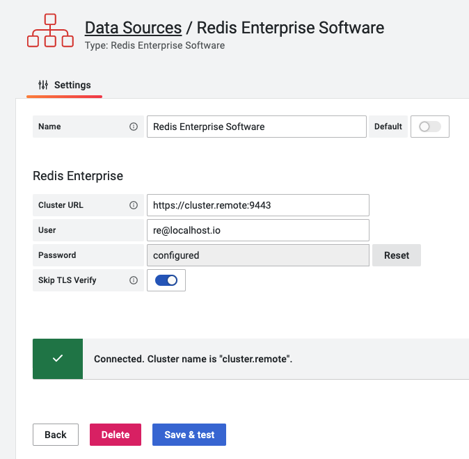

# Redis Enterprise Software Data Source

Redis Enterprise Software Data Source allows connecting to Redis Enterprise software clusters using REST API.

!!! quote "REST API [Specification](https://storage.googleapis.com/rlecrestapi/rest-html/http_rest_api.html)"

    Redis Enterprise clusters are a set of nodes, typically two or more, providing database services. Clusters are inherently multi-tenant, and a single cluster can manage multiple databases accessed through individual endpoints.

## Configuration

The [Configuration](configuration.md) page explains how to connect data source to Redis Enterprise software.

## Query Editor

1. Choose **Type** to select [Information](info.md) (Alerts, Cluster, License, etc.) or [Metrics](metrics.md)
2. Provide all required parameters, depends on selected **Type**

## Provisioning

To learn how to provision Redis Enterprise Software Data Source using YAML config files follow the [Redis Explorer provisioning](../provisioning.md) page.
